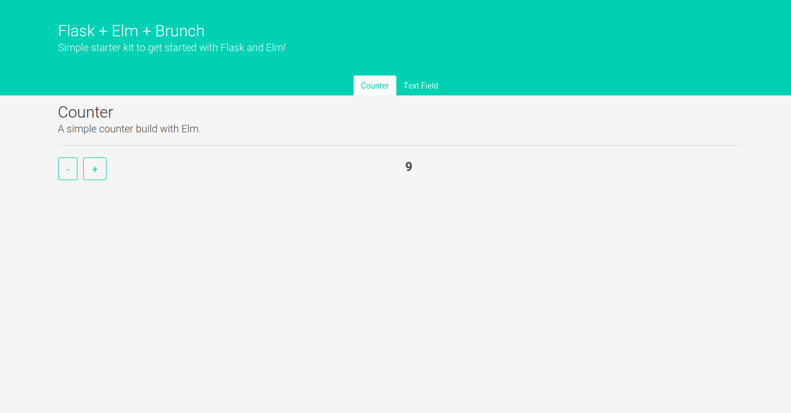

# flask-elm-starter-kit

A simple [Flask](http://flask.pocoo.org/) application with [Elm](http://elm-lang.org/) for the frontend.

This starter kit shows how to use [Elm](http://elm-lang.org/) with a Flask application.

All pages are rendered on the server. Elm provides parts of the frontend instead of using plain Javascript. This example should how to use Elm in none single page applications and how to integrate it with existing Javascript code.



[Brunch](http://brunch.io/) is used as the build tool.

## Requirements

  * Elm >= 0.18
  * Node >= 5
  * Python >= 2.7

## Get Started

Clone the repository:

```
$ git clone https://github.com/hypebeast/flask-elm-starter-kit.git
```

Install all packages:

```
$ npm install
$ pip install -r requirements.txt
$ export FLASK_APP=autoapp.py
$ export FLASK_DEBUG=1
```

Now, start the server:

```
$ flask run
```

Run `brunch` in development mode:

```
$ npm run dev
```

Open your browser and go to `http://localhost:5000`.
